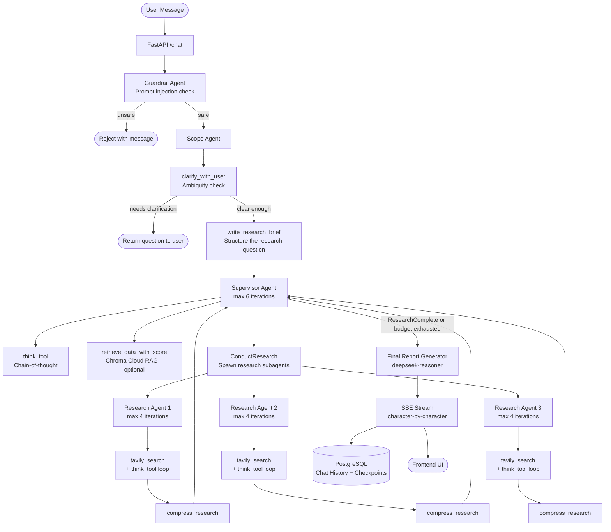

# Deep Research Assistant

An AI-powered research system built with a multi-agent architecture that conducts deep, multi-step research and delivers comprehensive reports. Users submit queries through a web UI or REST API, and a hierarchical agent workflow orchestrates research using specialized agents, web search, and LLMs to produce detailed findings with cited sources.

---

## Table of Contents

- [Features](#features)
- [Architecture Overview](#architecture-overview)
- [Agent Workflow Diagram](#agent-workflow-diagram)
- [Tech Stack](#tech-stack)
- [AI Engineering](#ai-engineering)
  - [Agent Orchestration](#agent-orchestration)
  - [LLMOps with Langfuse](#llmops-with-langfuse)
  - [Memory Persistence](#memory-persistence)
- [Project Structure](#project-structure)
- [Getting Started](#getting-started)
  - [Prerequisites](#prerequisites)
  - [Environment Variables](#environment-variables)
  - [Running with Docker Compose](#running-with-docker-compose)
  - [Manual Setup](#manual-setup)
- [API Reference](#api-reference)
- [Deployment](#deployment)
- [CI/CD Pipeline](#cicd-pipeline)

---

## Features

- Multi-agent research workflow: guardrail check → scope analysis → parallel research → synthesis
- Real-time streaming of workflow progress and final report via Server-Sent Events (SSE)
- Thread-based conversation history with persistent agent state across sessions
- JWT authentication with per-user message storage
- Safety guardrail that rejects prompt injection and off-topic requests before research begins
- Clarification agent that asks follow-up questions when the query is ambiguous
- Optional RAG over prior findings via Chroma Cloud vector store
- Full observability with Langfuse tracing (token usage, latency, tool calls per agent)
- Production-ready deployment on Azure App Service with GitHub Actions CI/CD

---

## Architecture Overview

```
User Request (HTTP POST /chat)
         │
         ▼
   FastAPI Backend (SSE stream)
         │
         ▼
   Guardrail Agent ──► Reject unsafe / off-topic queries
         │
         ▼
   Scope Agent
   ├── clarify_with_user  ──► Ask follow-up if query is ambiguous → END (awaits reply)
   └── write_research_brief ──► Transform conversation into a structured research brief
         │
         ▼
   Supervisor Agent (up to 6 iterations)
   ├── think_tool            (chain-of-thought reasoning)
   ├── retrieve_data_with_score  (RAG over prior findings, optional)
   ├── ConductResearch ──► Research Agent 1 (async) ─┐
   ├── ConductResearch ──► Research Agent 2 (async) ─┤ asyncio.gather
   └── ConductResearch ──► Research Agent 3 (async) ─┘
         │
         ▼ (compressed findings returned)
   Final Report Generator (deepseek-reasoner)
         │
         ▼
   SSE stream → Frontend
         │
         ▼
   PostgreSQL (Chat History + LangGraph Checkpoints)
```

---

## Agent Workflow Diagram



---

## Tech Stack

| Layer | Technology |
|---|---|
| Backend Framework | FastAPI (async) |
| Agent Orchestration | LangGraph 0.2+ |
| LLMs | DeepSeek (`deepseek-chat`, `deepseek-reasoner`) |
| Web Search | Tavily API |
| LLMOps / Observability | Langfuse 2.0+ |
| Database | PostgreSQL 16 |
| ORM | SQLAlchemy 2.0 (async) |
| Agent State Checkpointing | LangGraph AsyncPostgresSaver |
| Vector Store (optional RAG) | Chroma Cloud |
| Auth | JWT (python-jose) |
| Streaming | Server-Sent Events (SSE) |
| Frontend | Next.js 14, Tailwind CSS |
| Containerization | Docker, Docker Compose |
| Deployment | Azure App Service |
| Package Manager | `uv` (Python), `npm` (Node) |

---

## AI Engineering

### Agent Orchestration

The system uses a **hierarchical multi-agent architecture** built on LangGraph. The graph is compiled once at startup with a persistent PostgreSQL checkpointer and invoked per user thread, enabling stateful multi-turn conversations.

#### Agent Hierarchy

```
1. Guardrail Agent
   └── Inspects the latest user message for prompt injection and off-topic content
       Returns GuardrailDecision(is_safe, rejection_message)
       Blocks the workflow entirely if unsafe — no research is started

2. Scope Agent
   ├── clarify_with_user  → LLM decides if the query needs a follow-up question
   │                        If yes: returns question to user and halts (awaiting_clarification=True)
   └── write_research_brief → Transforms the full conversation into a structured research brief
                              The brief is passed directly as the first supervisor message

3. Supervisor Agent (subgraph, max 6 decision iterations)
   ├── think_tool                  → Internal chain-of-thought, no external calls
   ├── retrieve_data_with_score    → RAG over Chroma Cloud (skipped if ENABLE_RAG=false)
   ├── ConductResearch             → Spawns 1–3 Research Agents in parallel via asyncio.gather
   └── ResearchComplete            → Signals research is done, triggers final report

4. Research Agent (per topic, spawned by Supervisor, max 4 iterations)
   ├── llm_call   → Decides whether to search or stop
   ├── tool_node  → Executes tavily_search (with Tavily pre-extracted snippets) + think_tool
   └── compress_research → Summarizes all findings into a concise compressed_research string
                           Raw notes also extracted for final report detail

5. Final Report Generator
   ├── Uses deepseek-reasoner for high-quality synthesis
   ├── Receives all compressed findings + raw notes + research brief
   └── Streams output character-by-character via SSE
```

#### Key Design Decisions

| Decision | Rationale |
|---|---|
| **Guardrail before scope** | Blocks unsafe queries before any expensive LLM calls are made |
| **Async-first research** | `asyncio.gather` runs multiple Research Agents in parallel — concurrent topic research without blocking |
| **Budget control** | Supervisor iteration limit (6) + per-agent iteration limit (4) prevent runaway costs and infinite loops |
| **Command-based routing** | LangGraph `Command` objects route between nodes dynamically based on agent decisions, not static edges |
| **Structured outputs** | Pydantic schemas (`ClarifyWithUser`, `ResearchQuestion`, `GuardrailDecision`, `Summary`) enforce typed LLM outputs to prevent hallucinated tool calls |
| **Modular agents** | Each agent (`guardrail`, `scope`, `supervisor`, `research`, `final_reporter`) is an independent module — testable and replaceable |
| **Model routing** | `model_config.yaml` maps each agent role to a specific model, temperature, token budget, and timeout — decouples orchestration from model selection |
| **YAML prompt templates** | All prompts centralized in `prompt_templates.yaml` and loaded at module init — enables prompt versioning without touching business logic |
| **Tavily snippets only** | `include_raw_content=False` uses Tavily's pre-extracted text snippets instead of raw HTML — prevents context explosion from full page content |
| **Tool result truncation** | Each tool result is capped at 12,000 chars; supervisor ToolMessages capped at 20,000 chars; final findings capped at 80,000 chars — stays within DeepSeek's 131K context limit |

#### Workflow Execution

When a user sends a message, [workflow_executor.py](src/agents/workflow_executor.py) compiles the LangGraph state machine and invokes it:

```python
deep_researcher_agent = compile_deep_researcher(checkpointer=postgres_checkpointer)

# Each user thread resumes from its persisted checkpoint
async for event in deep_researcher_agent.astream(
    {"messages": [HumanMessage(content=user_message)]},
    config={"configurable": {"thread_id": thread_id}},
    stream_mode=["updates", "messages"],
    subgraphs=True,
):
    yield format_sse_event(event)
```

---

### LLMOps with Langfuse

[Langfuse](https://langfuse.com) provides full observability over every LLM call in the system without modifying agent logic.

#### What is Traced

- Every LLM call across all agents — inputs, outputs, token counts, latency
- Tool invocations — Tavily search queries and results, think_tool chains
- Agent decision paths — which supervisor iteration triggered which research agent
- Full conversation traces grouped by `thread_id`

#### How It Works

Langfuse's `CallbackHandler` is injected into every model in [src/llm/model_wrapper.py](src/llm/model_wrapper.py). It hooks into LangChain's callback system and automatically captures the full execution trace:

```python
from langfuse.langchain import CallbackHandler

def create_model(agent_name: str) -> ChatOpenAI:
    callbacks = []
    if os.getenv("LANGFUSE_PUBLIC_KEY"):
        callbacks.append(CallbackHandler())
    return ChatOpenAI(..., callbacks=callbacks)
```

The handler is also flushed explicitly at the end of each SSE stream (shielded from uvicorn task cancellation) to prevent trace loss on client disconnect.

Langfuse is **fully optional** — if the environment variables are absent, the system runs without tracing and raises no errors.

#### What You Can Monitor

- Token consumption broken down by agent, model, and session
- End-to-end latency per phase (guardrail → scope → supervisor → research → synthesis)
- Full prompt/completion pairs for debugging agent behavior
- Parallel research agent traces showing which topics were investigated and in what order

#### Configuration

```bash
LANGFUSE_PUBLIC_KEY=pk-lf-...
LANGFUSE_SECRET_KEY=sk-lf-...
LANGFUSE_BASE_URL=https://cloud.langfuse.com
```

---

### Memory Persistence

The system uses a **two-layer persistence model** separating user-facing chat history from internal agent state.

#### Layer 1 — Chat History (PostgreSQL ORM)

User messages and assistant responses are stored in a `chat_history` table, written by [ChatRepository](src/db/repositories/chat_repository.py) after each workflow completion.

```
users        → id, username, email, hashed_password
chat_history → id, user_id (FK), thread_id, role, content, created_at
```

- Retrieved on `GET /history/{thread_id}` for UI rendering
- Supports multiple named threads per user (sidebar thread list)
- DB write is wrapped in `asyncio.shield()` so it completes even if the client disconnects mid-stream

#### Layer 2 — Agent State Checkpointing (LangGraph AsyncPostgresSaver)

LangGraph's `AsyncPostgresSaver` persists the full agent graph state to PostgreSQL after each node execution. This is distinct from chat history — it stores internal agent state: message accumulations, research notes, scope decisions, and iteration counters.

```python
# src/db/database.py
from langgraph.checkpoint.postgres.aio import AsyncPostgresSaver

async def init_checkpointer():
    checkpointer = AsyncPostgresSaver.from_conn_string(DATABASE_URL)
    await checkpointer.setup()   # creates checkpoint tables if not present
    return checkpointer
```

When a user sends a follow-up message, LangGraph automatically restores the prior graph state from the checkpoint for that `thread_id`. The new message is appended and the workflow resumes with full context — no prior research is re-run. The `add_messages` reducer prevents duplicate message accumulation.

#### Summary

| What | Where | When |
|---|---|---|
| User messages & assistant responses | PostgreSQL `chat_history` table | After workflow completes |
| Agent graph state (full internal state) | PostgreSQL via LangGraph AsyncPostgresSaver | After each graph node |
| Auth tokens | JWT (stateless) | Per request |

---

## Project Structure

```
DeepResearchAssistant/
├── src/
│   ├── api/
│   │   ├── main.py                  # FastAPI app, lifespan, CORS, middleware
│   │   ├── routers/
│   │   │   ├── auth.py              # /register, /login
│   │   │   ├── chat.py              # /chat (SSE stream), Langfuse flush on cleanup
│   │   │   ├── history.py           # /history/{thread_id}, /threads
│   │   │   └── health.py            # /health
│   │   ├── schemas.py               # Pydantic request/response models (ChatRequest)
│   │   ├── security.py              # JWT creation & verification
│   │   └── streaming.py             # SSE event formatting, node status messages
│   ├── agents/
│   │   ├── guardrail_agent.py       # Prompt injection & off-topic detection
│   │   ├── scope_agent.py           # clarify_with_user & write_research_brief nodes
│   │   ├── supervisor_agent.py      # Supervisor loop, tool dispatch, iteration control
│   │   ├── research_agent.py        # Per-topic research loop, Tavily search, compress findings
│   │   └── workflow_executor.py     # LangGraph graph compilation, final report generation
│   ├── agent_interface/
│   │   ├── states.py                # LangGraph TypedDict state classes
│   │   │                            #   AgentInputState, AgentOutputState,
│   │   │                            #   SupervisorState, ResearcherState, ResearcherOutputState
│   │   ├── tools.py                 # ConductResearch, ResearchComplete tool definitions
│   │   └── schemas.py               # Pydantic structured output schemas
│   │                                #   ClarifyWithUser, ResearchQuestion,
│   │                                #   GuardrailDecision, Summary
│   ├── llm/
│   │   └── model_wrapper.py         # Model factory, Langfuse callback injection,
│   │                                # ainvoke_structured / invoke_structured helpers
│   ├── db/
│   │   ├── database.py              # SQLAlchemy engine, async session, checkpointer init
│   │   ├── models.py                # User, ChatMessage ORM models
│   │   └── repositories/
│   │       ├── chat_repository.py   # Chat history read/write
│   │       └── user_repository.py   # User lookup and creation
│   ├── config/
│   │   ├── model_config.yaml        # Agent → model routing, temperatures, token budgets, timeouts
│   │   └── prompt_templates.yaml    # All agent system prompts (versioned, no logic changes needed)
│   ├── utils/
│   │   └── tools.py                 # tavily_search, think_tool, summarize_webpage_content
│   │                                # Tavily cache, deduplication, result formatting
│   ├── data_retriever/
│   │   └── output_retriever.py      # retrieve_data_with_score — RAG over Chroma Cloud
│   │                                # Disabled by default (ENABLE_RAG=false)
│   ├── prompt_engineering/
│   │   └── templates.py             # get_prompt() loader for prompt_templates.yaml
│   └── frontend/                    # Next.js 14 app
│       ├── app/
│       │   ├── page.tsx             # Main chat UI
│       │   ├── types.ts             # TypeScript types for SSE events, messages, threads
│       │   └── components/          # Message, Sidebar, AuthModal, SourceCard
│       └── package.json
├── tests/
│   ├── unit/
│   └── integration/
├── docs/
│   └── agent_quality.md             # Agent quality evaluation notes
├── docker-compose.yml
├── Dockerfile
├── pyproject.toml
└── .github/workflows/               # GitHub Actions CI/CD
```

---

## Getting Started

### Prerequisites

- Docker & Docker Compose
- A [DeepSeek API key](https://platform.deepseek.com)
- A [Tavily API key](https://tavily.com)
- (Optional) A [Langfuse](https://langfuse.com) account for tracing
- (Optional) A [Chroma Cloud](https://trychroma.com) account for RAG

### Environment Variables

Copy `.env.example` to `.env` and fill in the required values:

```bash
cp .env.example .env
```

```bash
# Required
DEEPSEEK_API_KEY=sk-...
TAVILY_API_KEY=tvly-...
DATABASE_URL=postgresql+asyncpg://postgres:password@db:5432/research_db
AUTH_SECRET_KEY=your-32-character-minimum-secret-key

# Frontend
NEXT_PUBLIC_API_URL=http://localhost:8000

# Optional — LLMOps tracing (Langfuse)
LANGFUSE_PUBLIC_KEY=pk-lf-...
LANGFUSE_SECRET_KEY=sk-lf-...
LANGFUSE_BASE_URL=https://cloud.langfuse.com

# Optional — RAG over prior findings (Chroma Cloud)
ENABLE_RAG=false
CHROMA_CLOUD_HOST=...
CHROMA_CLOUD_API_KEY=...
CHROMA_CLOUD_PORT=443
```

### Running with Docker Compose

```bash
docker compose up --build
```

| Service | URL |
|---|---|
| Frontend | http://localhost:3000 |
| Backend API | http://localhost:8000 |
| API Docs (Swagger) | http://localhost:8000/docs |
| PostgreSQL | localhost:5432 |

### Manual Setup

**Backend**

```bash
# Install uv
pip install uv

# Install dependencies
uv sync

# Run the server (database tables created automatically on startup)
uv run uvicorn src.api.main:app --reload --host 0.0.0.0 --port 8000
```

**Frontend**

```bash
cd src/frontend
npm install
NEXT_PUBLIC_API_URL=http://localhost:8000 npm run dev
# Runs on http://localhost:3000
```

---

## API Reference

### Authentication

| Method | Endpoint | Description |
|---|---|---|
| `POST` | `/register` | Register a new user |
| `POST` | `/login` | Login, returns JWT access token |

### Research

| Method | Endpoint | Description |
|---|---|---|
| `POST` | `/chat` | Start or continue a research thread (SSE stream) |

**Request body:**
```json
{
  "message": "What are the latest advancements in fusion energy?",
  "thread_id": "unique-thread-uuid"
}
```

**SSE Event Types:**

| Event | Payload | Description |
|---|---|---|
| `status` | `{ node, message }` | Workflow phase updates (scope check, planning, researching, synthesizing) |
| `scope_message` | `{ node, content }` | Clarification question or scope confirmation from Scope Agent |
| `background_message` | `{ node, content }` | Tool execution details (search queries, sources found) |
| `content` | `{ delta }` | Final report delta chunks (streamed character-by-character) |
| `error` | `{ message }` | Workflow failure with error message |
| `done` | `{ thread_id, awaiting_clarification }` | Stream complete |

### History

| Method | Endpoint | Description |
|---|---|---|
| `GET` | `/history/{thread_id}` | Retrieve full conversation for a thread |
| `GET` | `/threads` | List all threads for the authenticated user |

### Health

| Method | Endpoint | Description |
|---|---|---|
| `GET` | `/health` | Health check |

> All `/chat`, `/history`, and `/threads` endpoints require `Authorization: Bearer <token>`.

---

## Deployment

The project deploys to **Azure App Service** with separate services for the backend and frontend.

### Backend (Python 3.12)

- Azure App Service with Linux + Python 3.12 runtime
- Environment variables configured in App Service Configuration panel
- PostgreSQL connection string uses `sslmode=require` for Azure-managed databases
- Health check endpoint configured for automatic restarts

### Frontend (Node.js 20)

- Next.js static export built during CI with `NEXT_PUBLIC_API_URL` injected at build time
- Served via `serve` on a Node.js Azure App Service
- Independent App Service from the backend for separate scaling

---

## CI/CD Pipeline

GitHub Actions workflows run on every push to `main`:

1. **Test** — unit and integration tests against a PostgreSQL service container
2. **Build backend** — Docker image build validation
3. **Deploy backend** — Azure App Service deployment via publish profile secret
4. **Build frontend** — `npm run build` with production environment variables
5. **Deploy frontend** — Azure App Service deployment

**Required GitHub Secrets:**

```
AZURE_WEBAPP_PUBLISH_PROFILE      # Backend App Service publish profile
AZURE_FRONTEND_PUBLISH_PROFILE    # Frontend App Service publish profile
NEXT_PUBLIC_API_URL               # Production API URL for frontend build
```
